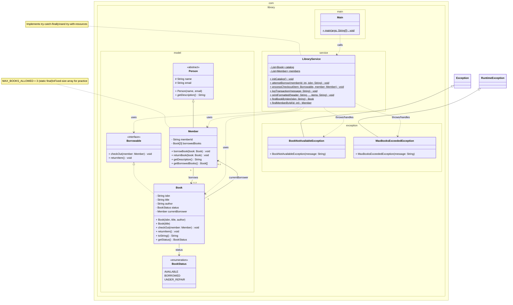

# Console Library Lending System (CLiLS)

A text-based Java application that simulates a small public library's lending operations. Built as a comprehensive practice project covering core Java concepts from JDK setup to exception handling and object-oriented design.

## Features

- **Catalog Management:** View all books with status (Available, Borrowed, Under Repair).
- **Member Registration:** Add new members with auto-generated IDs.
- **Borrowing System:** Members can borrow up to 3 books; business rules enforced.
- **Return Processing:** Return books and update availability.
- **Transaction Logging:** Every borrow/return attempt logged to a file using try-with-resources.
- **Console Interface:** Interactive menu with switch-case navigation.

## Technologies & Concepts Practiced

| Category               | Topics                                                       |
| ---------------------- | ------------------------------------------------------------ |
| **Environment**        | JDK 15, IntelliJ IDEA, manual compilation (`javac`/`java`), PATH configuration |
| **Core Java**          | Primitives, casting, operators, strings, arrays, multidimensional arrays |
| **Control Flow**       | `if`/`else`, `switch`, loops (`while`, `for`, `foreach`), `break`/`continue` |
| **OOP**                | Classes, objects, encapsulation, inheritance, abstract classes, interfaces, polymorphism |
| **Advanced OOP**       | Enums, static members, final modifier, method overloading/overriding, varargs |
| **Exception Handling** | Checked vs unchecked exceptions, custom exceptions, try-catch-finally, multi-catch, try-with-resources |
| **I/O**                | Scanner console input, FileWriter logging                    |
| **Design Patterns**    | Facade pattern (service layer), programming to interface     |

## Project Structure

```
src/
├── com.library.model/
│   ├── Person.java (abstract)
│   ├── Member.java
│   ├── Book.java
│   ├── Borrowable.java (interface)
│   └── BookStatus.java (enum)
├── com.library.exception/
│   ├── BookNotAvailableException.java (checked)
│   └── MaxBooksExceededException.java (unchecked)
├── com.library.service/
│   └── LibraryService.java (facade, logging, catalog management)
└── com.library.main/
    └── Main.java (console UI)
```

## Setup & Compilation

1. Ensure JDK 15+ is installed and `JAVA_HOME` is set.
2. Clone or create the project in IntelliJ IDEA (Community Edition).
3. Compile manually (optional):
   ```
   javac -d bin src/com/library/model/*.java src/com/library/exception/*.java src/com/library/service/*.java src/com/library/main/*.java
   ```
4. Run the application:
   ```
   java -cp bin com.library.main.Main
   ```

## Usage

Upon running, a menu appears:

```
===== Library Menu =====
1. Display Catalog
2. Register Member
3. Display Members
4. Borrow Book
5. Return Book
6. Exit
```

Follow the prompts to interact. All transaction attempts are recorded in `library_log.txt` with timestamps.

## Class Diagram



## Product Backlog Summary

| Epic           | Key Features                                    | Status      |
| -------------- | ----------------------------------------------- | ----------- |
| Foundation     | Project setup, packages, core classes           | Completed   |
| Business Logic | Borrow/return implementation, array management  | Completed   |
| Service Layer  | Transaction facade, logging, exception handling | Completed   |
| UI & Polish    | Console menu, display features, documentation   | In Progress |

Full backlog mapping to course videos (02-105) is available in the project documentation.

## License

This project is created for educational purposes as part of a Java refresher curriculum.

---

*Built to practice all topics from the "Java Funciona" video series (Videos 02–105).*